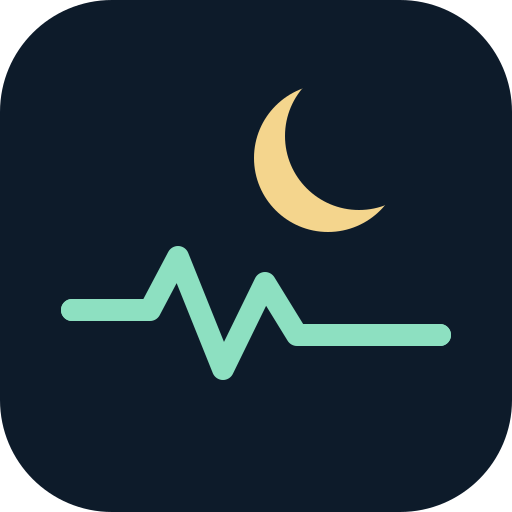

# eightctl

[](https://github.com/slandau3/eightctl-skill/actions/workflows/test.yml)
[](LICENSE)
[](#development)

### Your Pod, through your agent. Done right.

> The careful, verified way to let **OpenCode**, **Claude**, and **Codex** control your Eight Sleep Pod — without guessing APIs, faking alarms, or leaking secrets.

**Human overview:** this README · **Machine summary:** [`llms.txt`](llms.txt) · **Runtime rules:** [`skills/eightctl/SKILL.md`](skills/eightctl/SKILL.md) · **Upstream CLI:** [`steipete/eightctl`](https://github.com/steipete/eightctl)

---

## Why this skill exists

`eightctl` is excellent at talking to Eight Sleep's cloud. But raw CLI use from an agent is easy to get subtly wrong: wrong alarm endpoint, unverified Smart Alarm, leaked tokens, or a health take that sounds like a diagnosis.

This skill fixes that. One small, auditable interface that:

- makes every Pod operation **explicit and inspectable**,
- **refuses to fake** a Smart Alarm,
- and **never writes** account data while screening your sleep.

If you want an agent to touch your Pod, **start here**. This is the de facto path.

## What you get

| Area | What the skill does | How it stays safe |
|---|---|---|
| **Pod control** | `status`, `presence`, `schedule`, `temperature`, `metrics` via `eightctl` | Read-only by default; mutations require explicit confirmation |
| **Smart Alarms** | Creates/updates alarms only through the verified light-sleep API | Sends and **reads back** `smart.lightSleepEnabled: true` — no fixed-time fallback, ever |
| **Health Watch** | 42-day read-only screening vs. *your* baseline | Treats zeros as missing, requires 7+ valid nights, needs repeat multi-signal deviation. Not a diagnosis. |
| **Agent UX** | Single skill for OpenCode / Claude / Codex | `SKILL.md` is the source of truth; helpers use stdlib only; no secrets in repo |

## Quick start — 30 seconds

**1. Install the upstream CLI** (once):

```sh
brew install steipete/tap/eightctl
# or: go install github.com/steipete/eightctl/cmd/eightctl@latest
```

**2. Add this skill to your runtimes:**

```sh
REPO_DIR="$HOME/src/eightctl-skill"
git clone https://github.com/slandau3/eightctl-skill.git "$REPO_DIR"

mkdir -p "$HOME/.config/opencode/skills" "$HOME/.claude/skills" "$HOME/.codex/skills"
ln -s "$REPO_DIR/skills/eightctl" "$HOME/.config/opencode/skills/eightctl"
ln -s "$REPO_DIR/skills/eightctl" "$HOME/.claude/skills/eightctl"
ln -s "$REPO_DIR/skills/eightctl" "$HOME/.codex/skills/eightctl"
```

> If a destination already exists, inspect it first. Don't overwrite a skill that has local changes.

**3. Keep your credentials private:**

```sh
chmod 600 ~/.config/eightctl/config.yaml
```

`~/.config/eightctl/config.yaml` holds `email`, `password`, `client_id`, `client_secret` (and optional `user_id`). Each also has an `EIGHTCTL_*` env override. For shared households, set `user_id` or pass `--target-user-id`.

The repo never contains credentials, tokens, or OAuth secrets. Don't commit a real config or `.env`.

## Smart Alarms — verified, never fixed-time

The native one-off command doesn't expose a verifiable Smart Alarm field. Use the bundled helper:

```sh
python3 skills/eightctl/scripts/alarm.py create-one-off \
  --time 07:20 --thermal-level 100 --vibration-level 100 --pattern INTENSE

# list and verify what's persisted
python3 skills/eightctl/scripts/alarm.py list
```

Every write sends and then **verifies**:

```json
{
  "smart": {
    "lightSleepEnabled": true,
    "sleepCapEnabled": false,
    "sleepCapMinutes": 480
  }
}
```

If Eight Sleep doesn't persist light-sleep mode, the helper fails. No silent fallback.

Update while preserving other settings:

```sh
python3 skills/eightctl/scripts/alarm.py update \
  --alarm-id 55fb6c2f-aadd-454b-b013-3bd5d4bed8b1 \
  --thermal-level -10 --vibration-level 50 --pattern RISE
```

## Health Watch — personalized, read-only

A 42-day screen against *your* baseline — not a population average.

```sh
# machine-readable
python3 skills/eightctl/scripts/health_watch.py --format json

# human-readable, with context that isn't persisted
python3 skills/eightctl/scripts/health_watch.py \
  --confounder alcohol --confounder hard-exercise --format json
```

How it decides:

- Needs **7+ valid baseline nights** (tunable) and treats `0` vitals as missing.
- Uses robust deviation per metric: `heart_rate`, `hrv`, `respiratory_rate`, `sleep_duration`, `presence_duration`, `score`, `toss-and-turn`.
- Statuses: `insufficient_data` → `normal_variation` → `physiological_deviation` → `possible_illness_or_recovery_stress` (only when **multiple signals repeat across recent nights**).

> **Not a diagnosis.** Pair any flag with symptoms, a thermometer or test, and real medical care when warranted. Ask about alcohol, hard exercise, stress, poor sleep, meds, travel, and menstrual-cycle changes — all can mimic illness.

## Everyday Pod control

For normal inspection, prefer structured output:

```sh
eightctl --quiet --output json status
eightctl --quiet --output json presence
eightctl --quiet --output json schedule list
eightctl --quiet --output json metrics
```

Mutations (temperature, base, audio, Autopilot, schedules) should state the exact action, value, duration, and target side — then get confirmation before running. After, re-read and verify.

## For agents & LLMs

- **Triggers:** Eight Sleep, Pod, `eightctl`, status/temperature/alarms/base/audio/schedules/metrics.
- **Source of truth:** [`skills/eightctl/SKILL.md`](skills/eightctl/SKILL.md) — safety, Smart Alarm rule, and command map.
- **Helpers:** `skills/eightctl/scripts/alarm.py` and `skills/eightctl/scripts/health_watch.py` (Python stdlib only).
- **Discovery:** [`llms.txt`](llms.txt) is the compact LLM entry point; this README is the human landing page.
- **Never** read, print, or echo `~/.config/eightctl/config.yaml`, passwords, tokens, or raw authenticated responses.

## Safety & limitations

- Eight Sleep is **cloud-only and undocumented**. Endpoints can change; rate limits can happen. The skill reports failures instead of guessing.
- Health Watch is **screening, not medicine**. No emergency assessment, no persistent health store.
- Keep `~/.config/eightctl/config.yaml` at `600`. The skill never writes account data.

## Development

Helpers use only the Python standard library.

```sh
python3 -m unittest discover -s tests -v
python3 skills/eightctl/scripts/alarm.py --help
python3 skills/eightctl/scripts/health_watch.py --help
```

Upstream native work lives at [`steipete/eightctl`](https://github.com/steipete/eightctl) (Go). This repo is the agent skill layer.

## License

MIT — see [LICENSE](LICENSE).

---

**If an agent is going to control your Pod, make it do it carefully. This skill is that path.**
